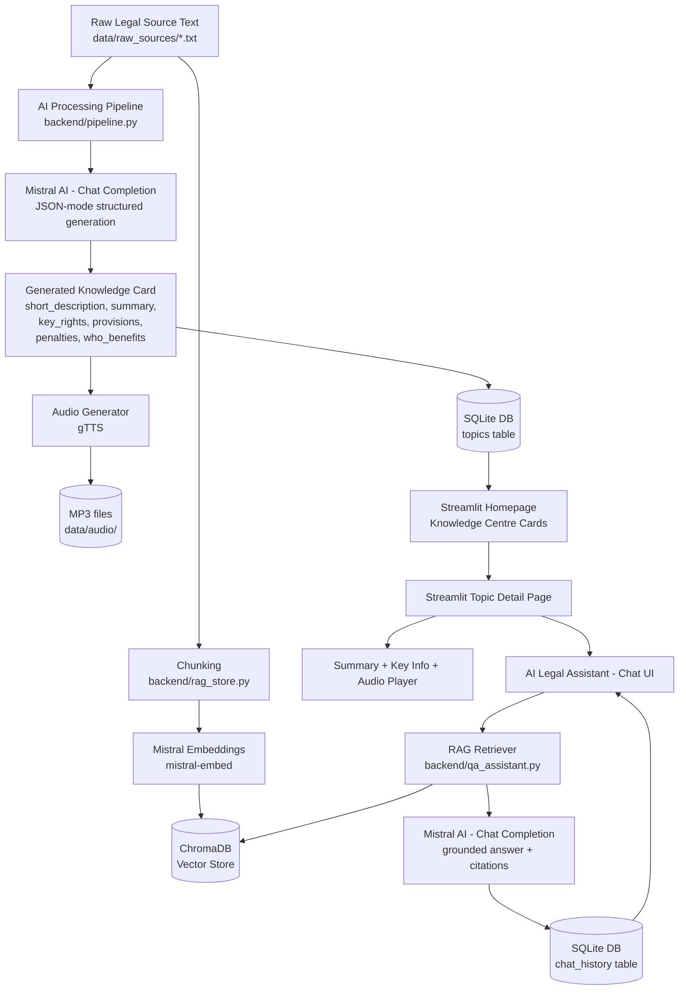

# LegalX AI Knowledge Centre — Architecture

## Flow Summary

1. **Ingestion**: Raw legal text per topic lives in `data/raw_sources/*.txt`.
2. **AI Processing Pipeline** (`backend/pipeline.py`): sends raw text to Mistral AI with a
   strict JSON schema prompt → produces card content (description, summary, key info).
3. **Storage**: Generated cards persisted in SQLite (`data/legalx.db`).
4. **RAG Indexing** (`backend/rag_store.py`): raw text is chunked, embedded via
   `mistral-embed`, and stored in a persistent ChromaDB collection.
5. **Audio Generation** (`backend/audio_generator.py`): summary text converted to MP3
   via gTTS, cached on disk.
6. **Frontend** (Streamlit): homepage lists auto-generated cards; topic detail page shows
   summary, key info tabs, audio player/download, and an AI Legal Assistant chat.
7. **AI Legal Assistant** (`backend/qa_assistant.py`): retrieves top-k relevant chunks for
   the user's question (scoped to the selected topic), builds a grounded prompt, and asks
   Mistral to answer using only that context — with source chunk citations and chat history.
