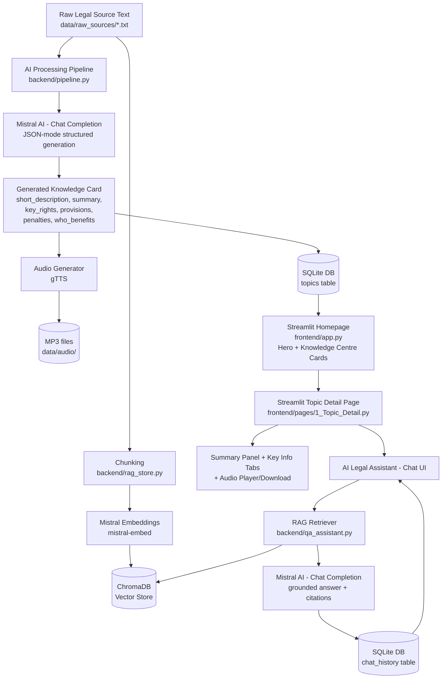

# LegalX AI Knowledge Centre — Architecture

## Flow Summary

1. **Ingestion**: Raw legal text per topic lives in `data/raw_sources/*.txt`, fetched
   live (or from cache) by `backend/source_fetcher.py`.
2. **AI Processing Pipeline** (`backend/pipeline.py`): sends raw text to Mistral AI with a
   strict JSON schema prompt → produces card content (description, summary, key info).
3. **Storage**: Generated cards persisted in SQLite (`data/legalx.db`), via
   `backend/database.py`.
4. **RAG Indexing** (`backend/rag_store.py`): raw text is chunked, embedded via
   `mistral-embed`, and stored in a persistent ChromaDB collection
   (`vectorstore/`), scoped per `topic_id`.
5. **Audio Generation** (`backend/audio_generator.py`): summary text converted to MP3
   via gTTS, cached on disk and keyed by a content hash of the summary.
6. **Frontend** (Streamlit, multi-page):
   - `frontend/app.py` — homepage with a gradient hero banner, a "Run AI Processing
     Pipeline" trigger for any unprocessed topics, and a responsive 3-column grid of
     auto-generated topic cards (badge + name + short description + "Read More").
   - `frontend/pages/1_Topic_Detail.py` — topic detail page with:
     - A summary panel (Feature 2)
     - Tabbed key-information sections: Key Rights, Important Provisions, Penalties,
       Who Can Benefit (Feature 3)
     - A sidebar audio card with player, download button, and generation metadata
       (Feature 5)
     - An AI Legal Assistant chat interface with an example-question hint, scrollable
       chat history, source citations, and a "Clear chat history" control (Feature 4)
7. **AI Legal Assistant** (`backend/qa_assistant.py`): retrieves top-k relevant chunks for
   the user's question (scoped to the selected topic) via `backend/rag_store.py`, builds
   a grounded prompt, and asks Mistral to answer using only that context — with source
   chunk citations and recent chat history for conversational continuity.

## Frontend Notes

- Both pages share a consistent visual identity: a blue gradient hero/header,
  white card panels with soft shadows and rounded corners, and a matching gradient
  header on the AI Legal Assistant section.
- Styling is implemented via scoped CSS injected through `st.markdown(..., unsafe_allow_html=True)`
  in each page — no changes to backend contracts or data shapes were required.
- Layout is responsive: card grids, hero padding, and chat/assistant elements adjust
  for narrower (mobile) viewports via CSS media queries.
- The chat interface uses `st.container(height=350, border=True)` with an explicit
  white background to keep message contrast readable, `st.chat_message` for
  user/assistant bubbles, and `st.expander` for per-answer source citations.
- Navigation between pages uses `st.switch_page` and `st.session_state["selected_topic"]`
  to pass the selected topic id from the homepage to the detail page.